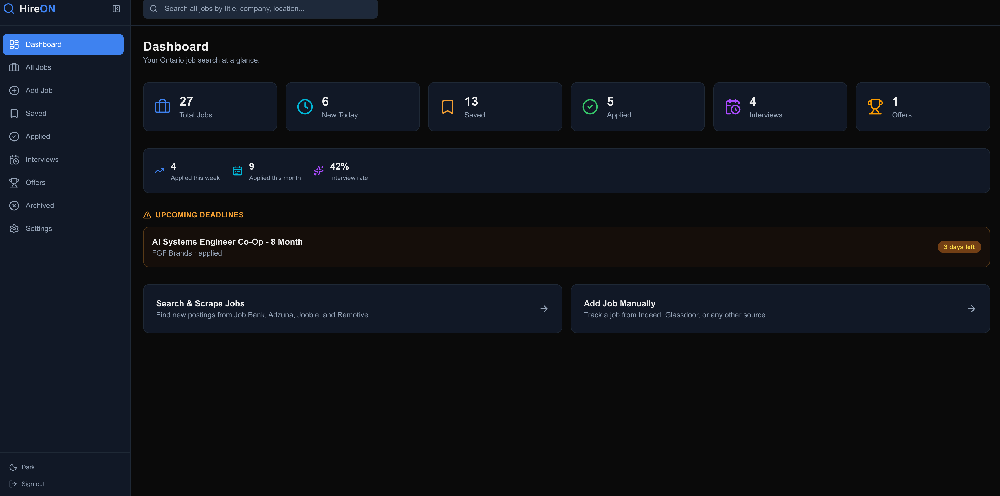
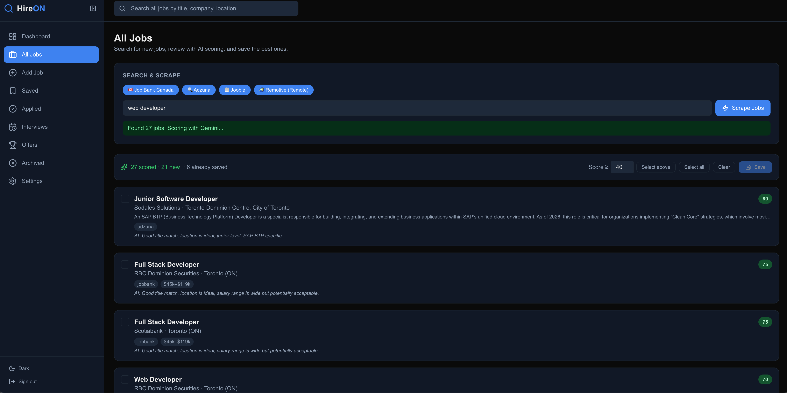

# HireON

AI-powered job search dashboard for Ontario, GTA, and Toronto. Scrapes postings from multiple open sources, scores them with Gemini for relevance, and lets you track your entire application pipeline in one place.

**Live demo:** [hireon-jobs.vercel.app](https://hireon-jobs.vercel.app) (Guest mode available — no sign-up needed to explore)

## Preview

### Dashboard


### AI-Powered Job Search


## Features

**Search & Scrape**
- Multi-source scraping — Job Bank Canada, Adzuna, Jooble, Remotive
- AI relevance scoring — Gemini rates each job 0–100 based on your customizable profile
- Preview before saving — review, score, and cherry-pick jobs before they hit your database
- Cross-source deduplication — same job from different sources is detected and merged
- Already-saved detection — previously saved jobs are grayed out in preview

**AI Auto-fill for Manual Job Entry**
- Paste a job posting URL → Gemini extracts title, company, salary, deadline, etc.
- "From Pasted Text" fallback for JavaScript-rendered sites
- **ATS adapters** that hit official APIs (no scraping needed) for major platforms:
  - Workday (BMO, RBC, Scotiabank, enterprise)
  - Greenhouse (Shopify, Stripe, Airbnb)
  - Lever (Netflix, Quora, Eventbrite)
  - Ashby (Linear, Vercel, modern startups)
  - JSON-LD universal fallback (schema.org JobPosting markup — works on most modern career sites)
- Anti-hallucination guardrails: strict JSON schema, low temperature, AI badges on auto-filled fields

**Job Tracking**
- Full pipeline: Saved → Applied → Interview → Offer → Rejected → Archived
- Job detail modal with status transitions, application timeline, notes, and inline edit mode
- Quick status buttons on cards (one-click "Applied", "Archive", etc.)
- Bulk actions (multi-select, change status, delete)
- Contextual fields per status: application method, interview details, offer salary, rejection/archive reasons

**Dashboard**
- Stat cards: Total Jobs, New Today, Saved, Applied, Interviews, Offers
- Application stats: applied this week, applied this month, interview rate
- Deadline alerts for jobs expiring in the next 7 days
- Follow-up reminders for jobs needing a response
- Global search across all jobs from the topbar

**Analytics Page**
- Weekly applications bar chart (last 8 weeks)
- Status distribution donut chart
- Jobs by source horizontal bar chart
- Conversion funnel (applied → interview → offer)

**More**
- Manual job entry with duration and salary period options
- CSV export on all pages with page-specific filenames
- Light/dark/system theme toggle with theme-aware logo
- Collapsible sidebar
- Mobile responsive (hamburger menu, slide-out drawer)
- Settings page for default keywords, location, sources, and AI scoring context
- SEO meta tags (Open Graph, robots.txt, sitemap.xml)

**Auth & Security**
- Google OAuth and email magic-link login
- Guest mode for portfolio viewers (read-only — scrape & AI work, but no DB writes)
- Row Level Security — each user only sees their own jobs
- All API routes auth-protected at the route level + RLS at the database level
- Auth cookies are httpOnly + secure + sameSite

## Tech Stack

- Next.js 16 (App Router) + TypeScript
- Tailwind CSS v4 + Lucide icons
- Supabase (PostgreSQL + Auth + RLS)
- Google Gemini API (model selected with `GEMINI_MODEL`)
- Recharts for analytics
- Cheerio + Axios for scraping
- Vercel for deployment

## Setup

```bash
git clone https://github.com/mikeylim/HireON.git
cd HireON
npm install
cp .env.example .env.local
# Fill in your API keys in .env.local
```

Run all migrations in order from `supabase/migrations/` via the SQL Editor in your Supabase dashboard.

Configure auth in Supabase: enable Google provider, set Site URL and redirect URLs.

```bash
npm run dev
```

## Roadmap

- [ ] Resume upload for personalized AI scoring
- [ ] More ATS adapters (SmartRecruiters, BrassRing, iCIMS)
- [ ] n8n integration (Google Sheets + WhatsApp notifications)
- [ ] Automated daily scraping
